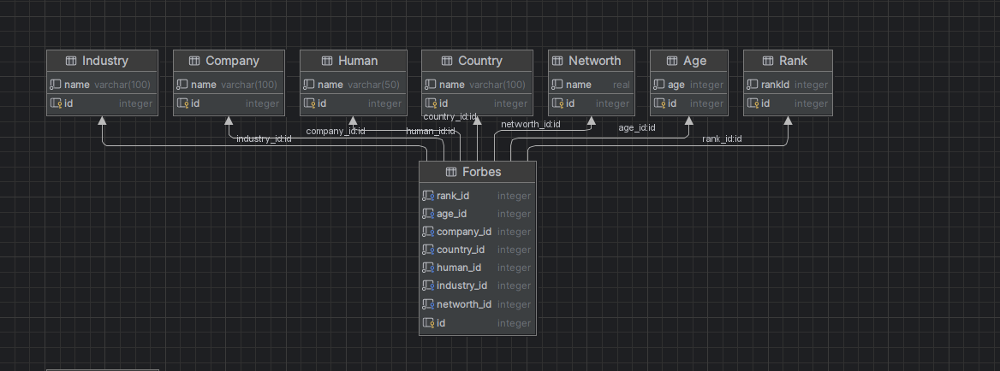
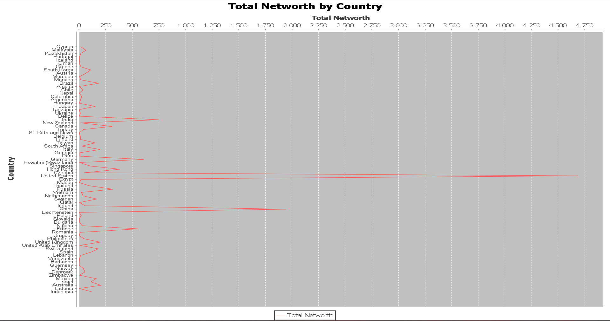
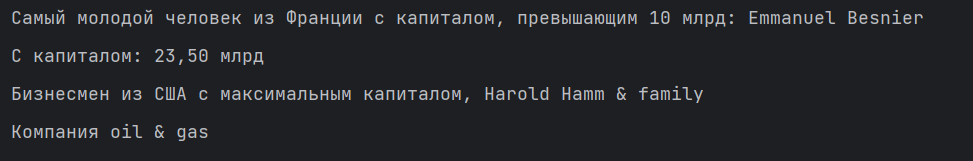

# Отчет

1. Главный класс main, в нем выполняется статический метод класса Application, который запускает цепочку вызовов методом нашего приложения.
2. Далее парсится csv файл, потом конвертируется с помощью маппера mapsruct.
3. Далее создается экземпляр класса DataBase который создает таблицы в базу данных,  мигрирует данные которые мы распарсили.
4. Ну и в конце строится диаграмма с помощью метода taskOne(), и выполняются консольные задания 2 и 3 с помощью методов taskTwo() и taskThree().

#### Диаграмма базы данных

#### Выполненные задания

